# Way of the Berserker

A simple mod for the bloodthirsty.

## Requirements

This Mod runs in [Fabric](https://fabricmc.net) and requires [Fabric API](https://www.curseforge.com/minecraft/mc-mods/fabric-api).

## Mod Info

#### Blood Diamond Ore
* Only spawns in the Nether
* Each block drops 0-3 Blood Diamonds
* Only 1 vein per chunk; each vein being 0-3 total ore blocks

#### Item Stats

| Tool                   | Damage | Speed | Mining Level |
|------------------------|--------|-------|--------------|
| Blood Diamond Sword    | 9      | 1.6   | -            |
| Blood Diamond Pick Axe | 7      | 1.2   | 4            |
| Blood Diamond Shovel   | 6.5    | 1.2   | -            |
| Blood Diamond Hoe      | 1      | 5     | -            |
| Blood Diamond Axe      | 11.5   | 1.2   | -            |

| Armor                    | Modifier | Toughness | Knockback Res. |
|--------------------------|----------|-----------|----------------|
| Blood Diamond Helmet     | +4       | +3        | +2             |
| Blood Diamond Chestplate | +9       | +3        | +2             |
| Blood Diamond Leggings   | +7       | +3        | +2             |
| Blood Diamond Boots      | +3       | +3        | +2             |

Click to show recipes

| Item                     | Recipe                                   |
|--------------------------|------------------------------------------|
| Blood Diamond Helmet     | 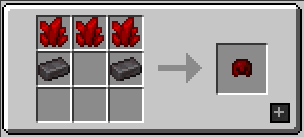         |
| Blood Diamond Chestplate | 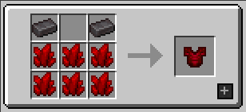 |
| Blood Diamond Leggings   | 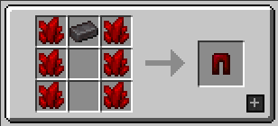     |
| Blood Diamond Boots      | 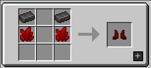           |
| Blood Diamond Sword      | 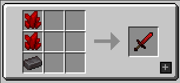           |
| Blood Diamond Pick Axe   | 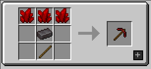      |
| Blood Diamond Axe        | 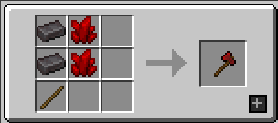               |
| Blood Diamond Shovel     | 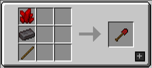         |
| Blood Diamond Hoe        | 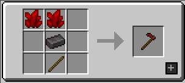               |
| Blood Diamond Block      | 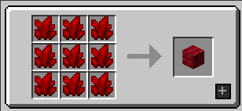           |

Click to show screenshots

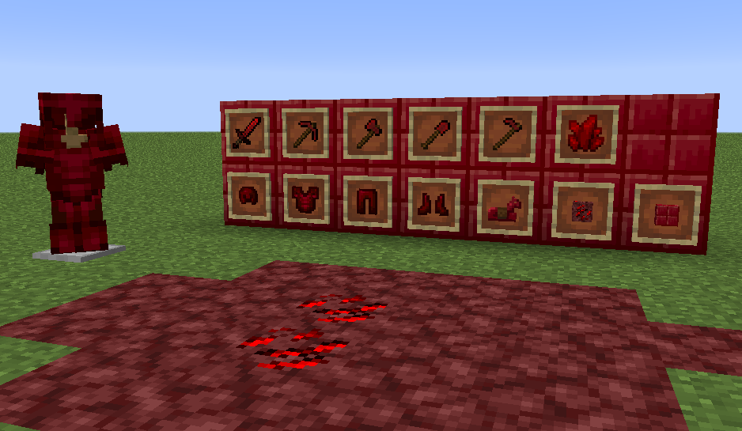

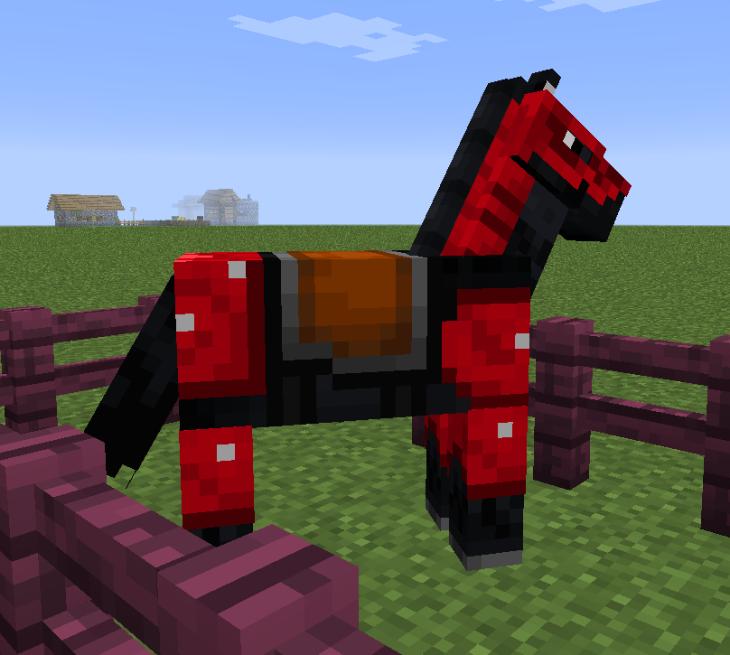

## Feature Milestones for v1.0.0

---

### ~~[Released] Milestone v0.1.0 - The Armored Release~~
* Full set of Blood Diamond armor and tools. Blood diamonds are rare and only found in the Nether.

---

### **[Current] Milestone v0.2.0 - The Technical Advantage**
* Axe and Swords work as weapons when in off-hand (right-click) at reduced damage and attack speed.

---

### _[Future] Milestone v0.3.0 - The Insanity Begins_
* Potion of the Berserker to remove the off-hand debuffs temporarily, and increase damage (Berserk effect).
  * Locks main-hand to a weapon _(how is the slot chosen?)_
  * Tint the screen red-orange and decrease FOV
  * Recipe: Raw meat (see below) + Awkward potion
* Eating raw meat gives the Berserker effect for a short amount of time
* Berserker effect added to the beacon.

| Raw Meat | Duration |
|----------|----------|
| Beef     | 10s      |
| Porkchop | 8s       |
| Chicken  | 8s       |
| Mutton   | 8s       |
| Salmon   | 4s       |
| Cod      | 4s       |
| Rabbit   | 4s       |

---

### _[Future] Milestone v0.4.0 - The Death Never Ends_
* Broadsword and Broadaxe, disabling the off-hand slot while active in the main-hand.
* Add kukri and bolo knife, no debuff in the off-hand by default/without buffs.
* Ninja throwing stars. Like other weapons, can be thrown from off-hand with debuffs.

---

### _[Future] Milestone v0.5.0 - The Piglins Rejoice_
* Berserker armor set and unique broadaxe. Found in Piglin Bastions.
* Piglins trade Blood Diamonds at high levels/prices.
* Piglins wear Blood Diamond armor if traded or given.

---

### _[Future] Milestone v0.6.0 - The Story is Told_
* Add Berserker tribe lore/history _(through a book in the initial inventory or random pages found in villages/chests?)_
  * Warmongering race from another dimension
  * Bros with the Piglins, except they totally slept with the Piglin's sister
  * Responsible for the link between the Nether and Overworld
  * Conquered and destroyed the Minecraft kingdoms to get access to The End
  * All out war occurred between the Berserkers and the Endians, resulting in the awakening of the Ender Dragon
  * Now the Berserkers retreat to rethink their strategy, no one has heard from them in years!
* Abandoned Berserker supply post structures in the Overworld
* Abandoned Berserker cave structures in the Nether
* Abandoned Berserker siege outposts in The End

---

### _[Future] Milestone v0.7.0 - The Invasion Begins!_
* Add Berserker Dimension
* Add Berserker and Berserker Elite hostile mobs
  * Only spawns in Berserker Dimension or in the vicinity of a Berserker portal
* Add Berserker Raids on the Overworld every 45 days
  * Only occurs after the Ender Dragon has been defeated
  * This is the only way to access Berserker Dimension portals

---

### _[Future] Milestone v0.8.0 - Berskers Need Love, Too_
* Add Berserker Covens in Berserker Dimension
* Add Berserker Villager NPCs and Professions
